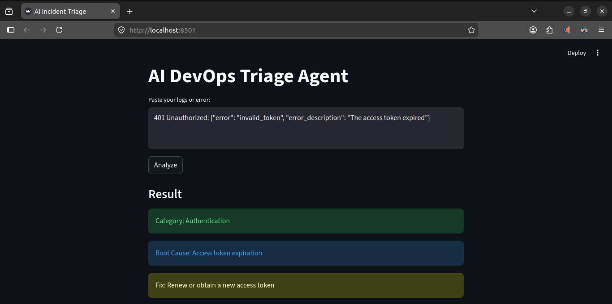

# 🚨 AI DevOps Incident Triage Agent

## Overview

This project is a lightweight AI-powered agent that analyzes logs and error messages, identifies likely root causes, and suggests actionable fixes.

It simulates a real-world **DevOps incident triage workflow**, helping engineers reduce debugging time and respond faster to production issues.

The system is intentionally simple, focusing on **reasoning over logs using an LLM**, rather than complex infrastructure.

---

## ✨ Features

* 🧠 Intelligent log analysis using LLM reasoning
* 📂 Automatic issue classification (Database, Auth, Network, Infra, etc.)
* 🔍 Root cause identification
* 🛠 Actionable fix recommendations
* 📦 Structured JSON output (robust parsing)
* 🌐 Simple UI via Streamlit
* ☁️ Deployable on Hugging Face Spaces

---

## 🏗️ Tech Stack

* LLM Inference: Groq (LLaMA models)
* Frontend/UI: Streamlit
* Backend: Python
* Deployment: Hugging Face Spaces / Docker

---

## 🧠 How It Works

```
User Input (logs/errors)
        ↓
LLM Agent (Groq)
   ├── Classification
   ├── Root Cause Analysis
   ├── Fix Suggestion
        ↓
Structured JSON Output
        ↓
Streamlit UI Display
```

The system uses a carefully designed prompt to enforce structured JSON output and includes fallback parsing to handle imperfect LLM responses.

---

## 🚀 Running Locally

### 1. Clone the repo

```bash
git clone https://github.com/syntaxland/ai-triage-agent.git
cd ai-triage-agent
```

---

### 2. Create virtual environment

```bash
python3 -m venv venv
source venv/bin/activate
```

---

### 3. Install dependencies

```bash
pip install -r requirements.txt
```

---

### 4. Set environment variable

```bash
export GROQ_API_KEY=your_api_key_here
```

---

### 5. Run the app

```bash
streamlit run app.py
```

Open:

```
http://localhost:8501
```

---

## 🐳 Running with Docker

```bash
docker build -t triage-agent .
docker run -p 8501:8501 -e GROQ_API_KEY=your_api_key triage-agent
```

---

## ☁️ Deployment (Hugging Face Spaces)

1. Create a Space on Hugging Face Spaces
2. Select **Streamlit SDK**
3. Push this repository
4. Add environment variable:

```
GROQ_API_KEY=your_api_key_here
```

5. App will auto-deploy and be publicly accessible

---

## 🧪 Sample Inputs (Test in Streamlit)

Use these examples to test different scenarios:

### Database Error

```
psycopg2.OperationalError: could not connect to server: Connection refused
Is the server running on host "localhost" and accepting TCP/IP connections on port 5432?
```

---

### Authentication Failure

```
401 Unauthorized: {"error": "invalid_token", "error_description": "The access token expired"}
```

---

### Kubernetes CrashLoop

```
Back-off restarting failed container
Error: CrashLoopBackOff
Container failed with exit code 1
```

---

### Missing Environment Variable

```
KeyError: 'DATABASE_URL'
```

---

### Disk Space Issue

```
OSError: [Errno 28] No space left on device
```

---

### Network Timeout

```
requests.exceptions.ConnectTimeout: HTTPSConnectionPool(host='api.stripe.com', port=443): Max retries exceeded
```

---

## 📊 Example Output

```json
{
  "category": "Database",
  "root_cause": "PostgreSQL server is not running or refusing connections",
  "fix": "Start PostgreSQL service and verify port 5432 is open"
}
```

---

## ⚠️ Limitations

* Relies entirely on LLM reasoning (no validation layer)
* No integration with real infrastructure (Kubernetes, AWS, etc.)
* Output accuracy depends on prompt quality
* No historical learning or memory

---

## 🔄 Tradeoffs

* ✅ Simplicity and speed of development
* ❌ No retrieval (RAG) or external knowledge base
* ❌ No automated remediation

---

## 🔮 Future Improvements

* Integrate with logging systems (AWS CloudWatch, Kubernetes)
* Add RAG with internal runbooks
* Introduce tool usage (e.g., suggest `kubectl`, `systemctl` commands)
* Add severity classification (critical/high/low)
* Store past incidents for learning
* Improve UI (chat-based interface, history, export)

---

## 🧠 Design Decisions

* Chose **LLM-only approach** instead of RAG to keep system lightweight
* Enforced structured JSON output for reliability
* Added fallback parsing to handle non-deterministic responses
* Used Groq for **low-latency inference**

---

## 📹 Demo

Loom walkthrough link:

```

[Video Link]

```

---

## 📁 Project Structure

```
.
├── app.py          # Streamlit UI
├── triage.py       # LLM logic + parsing
├── requirements.txt
├── Dockerfile
├── README.md
```

---

## 🧑‍💻 Author

JB

---

## 🪪 License

MIT License (or your preferred license)

---



